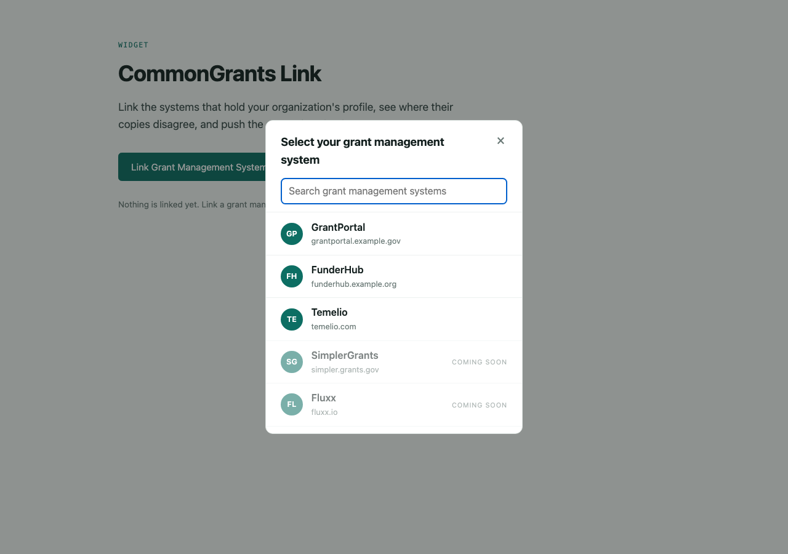
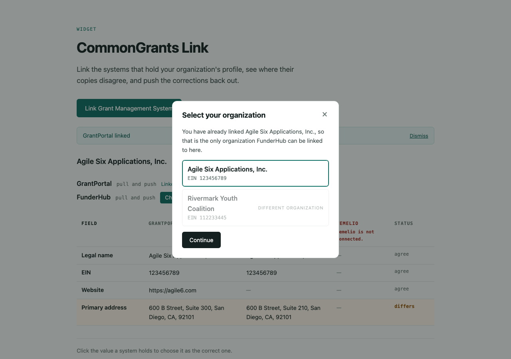
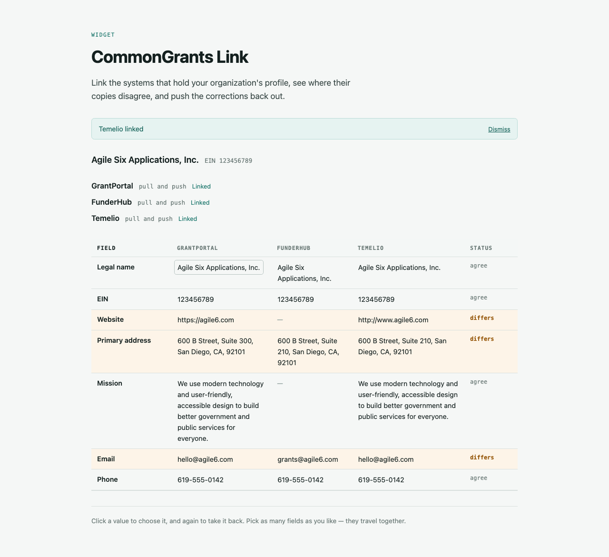
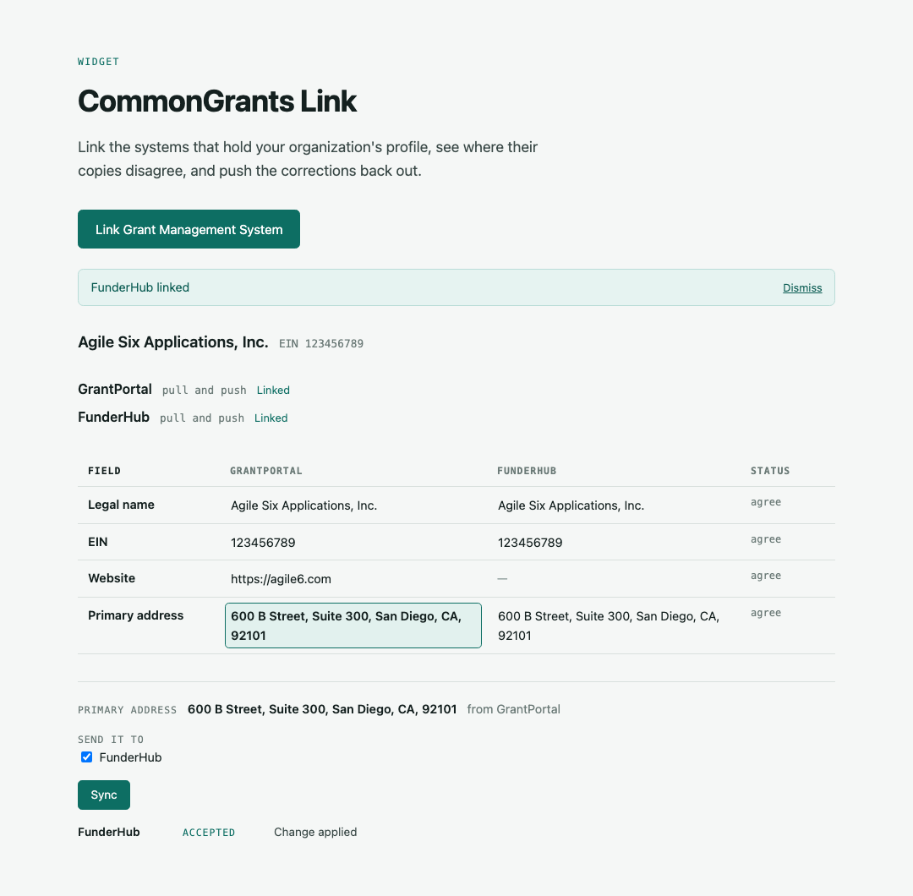
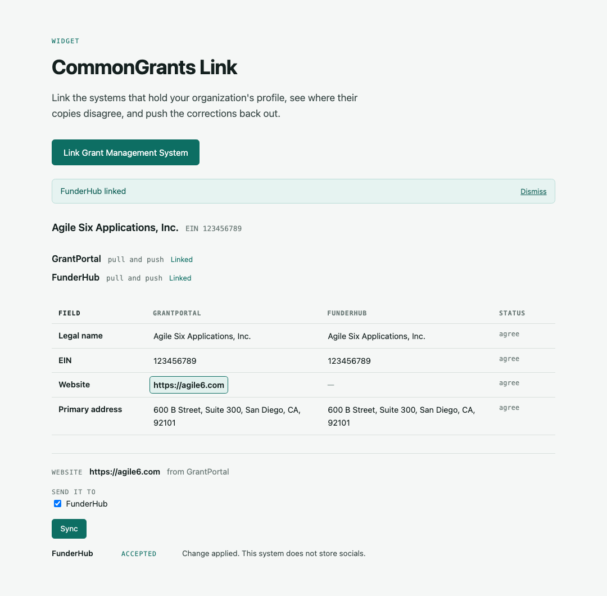

# CommonGrants Link

A working demo of one nonprofit's profile being kept in sync across independent grant systems,
using the [CommonGrants](https://commongrants.org) v0.4.0 organization routes.

## Why this exists

A nonprofit applies to many funders, and every funder's system holds its own copy of the same
organization profile-- e.g. legal name, EIN, address, website. Nobody keeps those copies in step. The
organization moves offices, updates one system, and the other three quietly go stale.

CommonGrants is an open protocol for grant data. Its org routes give every system one shared way
to look up, read, and update an organization profile. If systems speak that contract, a small tool
can read the profile from all of them at once, show where they disagree, and push the correct value
back out.

This repo proves that! Two independent systems each serve the org
routes over their own drifted copy of a profile, and a widget reads both, compares them, and writes
back. The whole exchange is covered by browser tests.

## What you can do with it

**Link the systems that hold your profile.** The widget opens on one button. Behind it is a list of
grant management systems — the two this demo runs, and others named but not wired up — the way you
would pick a bank in Plaid.



**Sign in to each system, on its own terms.** Every system runs its own sign-in and then tells the
widget which organizations you may act for. You pick one, and that is what the widget works on.



**See where systems disagree.** One row per field, one column per system. Rows that differ are
flagged. A field one system simply does not have shows as a gap, not a conflict. Link a second
system and it is held to the organization you already chose — matched by EIN, since no two systems
agree on ids.



**Fix a field everywhere in one click.** Click the value that is right, pick which systems should
receive it, and sync. Each system gets a JSON Merge Patch that changes only that field.



**Find out what a system could not store.** A system that does not model a field accepts the
change, drops the field, and says so.



**Reach a system that never implemented the protocol.** The third system in the picker is Temelio,
a real grants platform with its own API and no knowledge of CommonGrants. An adapter sits in front
of it and speaks the contract, so Link treats it as one more entry in a list. A push through the
widget lands as a write against Temelio's own API, and shows up on the grantee's page there.

Two fields come back declined, and the widget says which: Temelio has no field for an
organization type, and a funder cannot rename its grantee. That is the honest shape of a vendor
adapter, and saying so beats reporting a change that did not happen.

**Connect another system without new code.** Every system exposes the same routes, so a third one
is a config entry, not a feature.

```
GET   /common-grants/orgs             find an org by identifier, e.g. ?registry=org:us:ein&id=
GET   /common-grants/orgs/{orgId}     read one profile
PATCH /common-grants/orgs/{orgId}     apply a JSON Merge Patch
GET   /.well-known/jwks.json          this system's public keys
```

## Get set up

You need Node 22 or newer and pnpm 11.

```bash
pnpm install

# Each system reads its configuration from a gitignored .env. Copy all three:
cp apps/portal/.env.example apps/portal/.env
cp apps/funderhub/.env.example apps/funderhub/.env
cp apps/temelio-adapter/.env.example apps/temelio-adapter/.env

pnpm dev
```

Then open **http://localhost:5176** and connect each system. Out of the box they use a stand-in
sign-in form, so any address works — use `admin@example.org` to see all three systems, or
`portal-only@example.org` to be refused by two of them.

The Temelio adapter runs against an in-memory stand-in for Temelio's API unless you give it a real
credential, so it needs no vendor account to try. Its landing page says which mode it is in.

| App             | URL                     | What it is                                       |
| --------------- | ----------------------- | ------------------------------------------------ |
| Link            | `http://localhost:5176` | The widget. This is the one to open.             |
| GrantPortal     | `http://localhost:5173` | A system holding the current profile             |
| FunderHub       | `http://localhost:5174` | A system holding a stale copy, without `socials` |
| Temelio adapter | `http://localhost:5175` | A vendor's API behind the CommonGrants contract  |

Do not skip the `.env` step: a system with no configuration answers 401 to everything. Link needs
no `.env` — it holds no credentials, and forwards the token each system issues you.

Every value in the examples is a local placeholder, including the signing keys, which are real
private keys sitting in git. Generate your own for anything that is not localhost.

| Variable in each portal's `.env`              | What it does                                                    |
| --------------------------------------------- | --------------------------------------------------------------- |
| `CG_ACCESS_TOKEN`                             | A static service credential, for `curl` and the route specs     |
| `SIGNING_KEY_JWK`                             | That system's own ES256 key: signs its tokens, backs its JWKS   |
| `ENABLE_TEST_ROUTES`                          | Mounts `POST /__test/reset`; unset, that route 404s             |
| `IDENTITY_PROVIDER`                           | `fake` for the stand-in sign-in form; `google` for the real one |
| `GOOGLE_CLIENT_ID` / `GOOGLE_CLIENT_SECRET`   | The Google client, when `IDENTITY_PROVIDER` is not `fake`       |
| `SYSTEM_ORIGIN`                               | This system's own origin; defaults to the request's             |
| `LINK_ORIGIN`                                 | The only origin it will send an authorization code to           |
| `DEMO_ADMIN_EMAIL` / `DEMO_PORTAL_ONLY_EMAIL` | Real addresses for the two demo people, if you have them        |

The adapter carries those same variables, plus four of its own:

| Variable in `apps/temelio-adapter/.env` | What it does                                                     |
| --------------------------------------- | ---------------------------------------------------------------- |
| `TEMELIO_MODE`                          | `fixture` for the in-memory stand-in, `sandbox` for the real API |
| `TEMELIO_API_ORIGIN`                    | Where that API lives. Only read in `sandbox` mode                |
| `TEMELIO_FOUNDATION_ID`                 | The funder account the adapter acts as                           |
| `TEMELIO_API_TOKEN`                     | That funder's API key                                            |
| `TEMELIO_ORG_ALLOWLIST`                 | The only records it may read or change, comma-separated          |

The allowlist is not an optimization. `sandbox` mode talks to a live system holding other
organizations' data, so the adapter refuses to write to anything not named there — and refuses it
below every route, so no amount of wrong configuration elsewhere can reach a record that is not
ours.

### Signing in with Google instead

**The demo runs on the stand-in form, not Google.** Both portals ship set to `IDENTITY_PROVIDER=fake`,
which is also what `pnpm e2e` drives, so nothing here needs a Google account. The Google provider is
written and unit-tested against a local key set but has not been exercised against Google itself;
standing it up is the last ticket in the plan. What follows is what that will take.

The stand-in form is enough to run and demo everything. To use real Google sign-in, make one
project in the Google Cloud console with one **Web application** OAuth client:

- Authorized redirect URIs: `http://localhost:5173/oauth/callback`,
  `http://localhost:5174/oauth/callback` and `http://localhost:5175/oauth/callback` — each
  system's own callback, not Link's.
- Scopes: `openid` and `email`. Nothing else is read.
- Leave the consent screen in **Testing** and add the demo accounts as test users.

Then set `IDENTITY_PROVIDER=google`, `GOOGLE_CLIENT_ID` and `GOOGLE_CLIENT_SECRET` in both portals,
and point `DEMO_ADMIN_EMAIL` / `DEMO_PORTAL_ONLY_EMAIL` at the accounts you added. Only the portals
hold the client secret; Link never sees it.

### Tests

```bash
pnpm test                                    # unit tests for the shared library
pnpm --filter @cg-link/e2e install-browsers  # once per machine
pnpm e2e                                     # boots all three apps and drives the widget in a browser
```

`pnpm e2e` runs the real apps, so it needs both portal `.env` files and `IDENTITY_PROVIDER=fake` —
it signs in through the stand-in form and cannot drive Google. A portal set to `google` fails the
suite with a sentence naming it. `pnpm check`, `pnpm lint` and `pnpm format:check` cover types,
lint and formatting for the whole repo.

## What's in the repo

| Path                   | What it is                                                    |
| ---------------------- | ------------------------------------------------------------- |
| `packages/cg-org-sync` | Shared library: schemas, route handlers, client, comparison   |
| `packages/seed`        | The demo organization's profile, one drifted copy per system  |
| `apps/portal`          | "GrantPortal", a CommonGrants-native system                   |
| `apps/funderhub`       | "FunderHub", a second one that does not store every field     |
| `apps/link`            | The widget                                                    |
| `apps/temelio-adapter` | Planned proxy over a vendor that has not adopted the protocol |
| `e2e`                  | Playwright specs that run the real apps                       |

Storage is in memory, so restarting `pnpm dev` puts every system back to its seed — a stand-in
with an interface behind it, chosen so the demo shows the data exchange rather than
infrastructure. Each system signs its own access tokens and publishes the public half, and every
read and write is scoped to the organizations the caller may touch. Each is also its own sign-in: the
widget opens on a button, you pick systems from a list and link them one at a time, and each runs
its own sign-in. A system you have not linked simply says so in its column; the rest still answer.

## Status and what's next

The two-system exchange works end to end and is pinned by tests, and so is per-organization
access: each system runs its own sign-in flow and issues tokens scoped to what you may touch there.
Sign-in currently goes through a stand-in form rather than Google — see above. Not built yet: real
Google sign-in, embedding the widget inside a host system, the Temelio adapter, and durable
storage. The build plan lives outside this repo. Ask Billy for a copy.

## License

[MIT](LICENSE) © Agile Six Applications, Inc.
