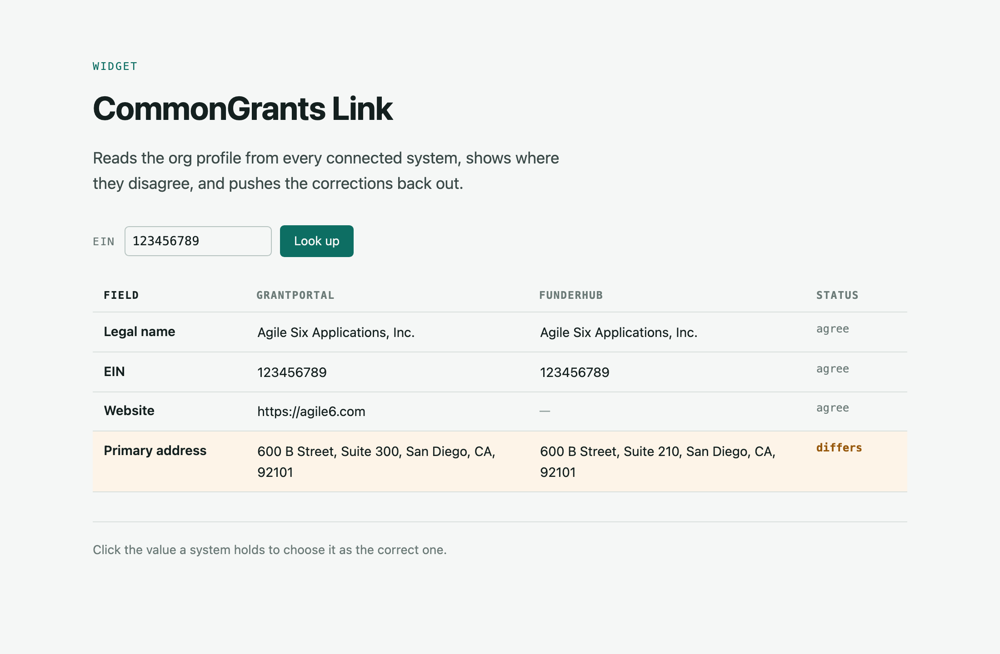
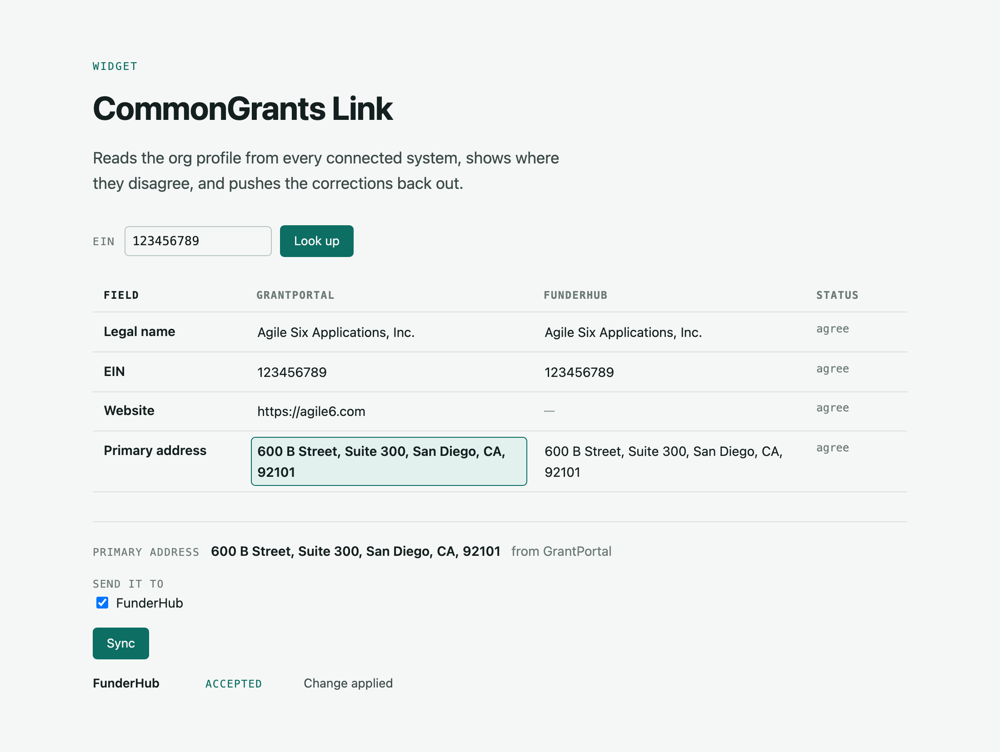
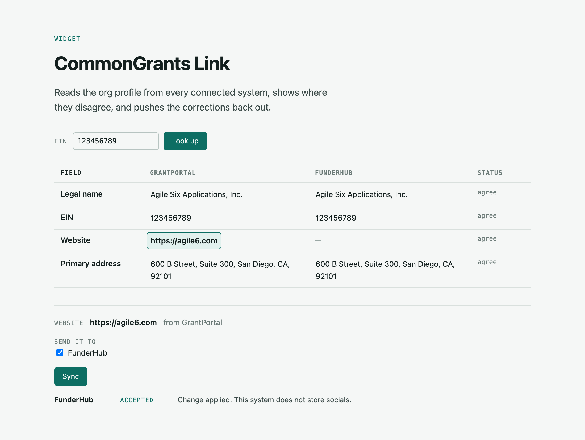

# CommonGrants Link

A working demo of one nonprofit's profile being kept in sync across independent grant systems,
using the [CommonGrants](https://commongrants.org) v0.4.0 organization routes.

## Why this exists

A nonprofit applies to many funders, and every funder's system holds its own copy of the same
organization profile-- e.g. legal name, EIN, address, website. Nobody keeps those copies in step. The
organization moves offices, updates one system, and the other three quietly go stale.

CommonGrants is an open protocol for grant data. Its org routes give every system one shared way
to look up, read, and update an organization profile. If systems speak that contract, a small tool
can read the profile from all of them at once, show where they disagree, and push the correct value
back out.

This repo proves that! Two independent systems each serve the org
routes over their own drifted copy of a profile, and a widget reads both, compares them, and writes
back. The whole exchange is covered by browser tests.

## What you can do with it

**See where systems disagree.** Look an organization up by EIN and get one row per field, one
column per system. Rows that differ are flagged. A field one system simply does not have shows as a
gap, not a conflict.



**Fix a field everywhere in one click.** Click the value that is right, pick which systems should
receive it, and sync. Each system gets a JSON Merge Patch that changes only that field.



**Find out what a system could not store.** A system that does not model a field accepts the
change, drops the field, and says so. 



**Connect another system without new code.** Every system exposes the same routes, so a third one
is a config entry and an access token, not a feature.

```
GET   /common-grants/orgs             find an org by identifier, e.g. ?registry=org:us:ein&id=
GET   /common-grants/orgs/{orgId}     read one profile
PATCH /common-grants/orgs/{orgId}     apply a JSON Merge Patch
```

## Get set up

You need Node 22 or newer and pnpm 11.

```bash
pnpm install

# Each app reads its access tokens from a gitignored .env. Copy all three:
cp apps/portal/.env.example apps/portal/.env
cp apps/funderhub/.env.example apps/funderhub/.env
cp apps/link/.env.example apps/link/.env

pnpm dev
```

Then open **http://localhost:5176**. The grid loads with the demo organization already looked up.

| App             | URL                     | What it is                                       |
| --------------- | ----------------------- | ------------------------------------------------ |
| Link            | `http://localhost:5176` | The widget. This is the one to open.             |
| GrantPortal     | `http://localhost:5173` | A system holding the current profile             |
| FunderHub       | `http://localhost:5174` | A system holding a stale copy, without `socials` |
| Temelio adapter | `http://localhost:5175` | Placeholder, not built yet                       |

Do not skip the `.env` step. Each system only answers requests carrying its own token, and Link
holds one token per system. Copying the three example files unchanged lines them up. The values are
local placeholders only.

### Tests

```bash
pnpm test                                    # unit tests for the shared library
pnpm --filter @cg-link/e2e install-browsers  # once per machine
pnpm e2e                                     # boots all three apps and drives the widget in a browser
```

`pnpm e2e` needs the same three `.env` files, since it runs the real apps. `pnpm check`, `pnpm lint`
and `pnpm format:check` cover types, lint and formatting for the whole repo.

## What's in the repo

| Path                   | What it is                                                    |
| ---------------------- | ------------------------------------------------------------- |
| `packages/cg-org-sync` | Shared library: schemas, route handlers, client, comparison   |
| `packages/seed`        | The demo organization's profile, one drifted copy per system  |
| `apps/portal`          | "GrantPortal", a CommonGrants-native system                   |
| `apps/funderhub`       | "FunderHub", a second one that does not store every field     |
| `apps/link`            | The widget                                                    |
| `apps/temelio-adapter` | Planned proxy over a vendor that has not adopted the protocol |
| `e2e`                  | Playwright specs that run the real apps                       |

Storage is in memory, so restarting `pnpm dev` puts every system back to its seed. Auth is a static
token per system. Both are stand-ins with an interface behind them, chosen so the demo shows the
data exchange rather than infrastructure.

## Status and what's next

The two-system exchange works end to end and is pinned by tests. Not built yet: embedding the
widget inside a host system, real per-system tokens and Google sign-in, the Temelio adapter, and
durable storage. The build plan lives outside this repo. Ask Billy for a copy.

## License

[MIT](LICENSE) © Agile Six Applications, Inc.
